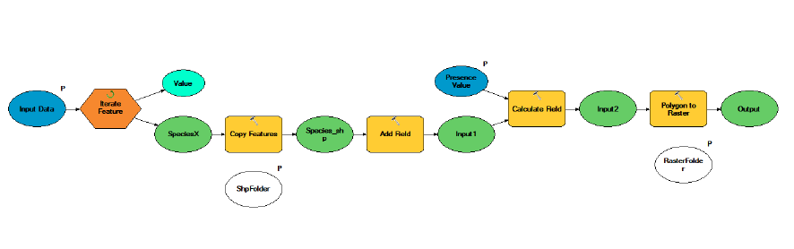

Arcpy Summary
==============

After successfully running the tool, you should have a
unique TIFF-file for each individual species in the original shapefile. In practice, we have executed the following process
chain in Python:

Think further:
--------------
Using a python script:

- How would you re-project all the TIFF-files into a projected coordinate system?
- Change the resolution (pixel size) of all the TIFF-files at once? (using the ``aggregate``-function)

Potential extensions of the tool
----------------------------------

** Calculating a field based on another field **

Unfortunately, some species might be Extinct, and thus we might want to exclude some species from the analysis based on a value from another layer.
The following code would re-classify values based on an existing field into 1 and 0.

.. code:: python

    # 3. Update the value for our newly created attribute based on a value in another column using the  'CalculateField_management' method
    # Assuming that we have a field ``presence`` in the original layer

    #   The coding of the new field corresponds to the following information (see metadata for IUCN species data):
    #   Extant (1) --> 1.0, Probably Extant(2)--> 1.0, Possibly Extant (3) --> 0.0,
    #   Possibly Extinct (4) --> 0.0  Extinct (5) --> 0.0, Presence Uncertain (6) --> 0.0

    #Define code block

    getPresenceValue = "getValue(!presence!)"
    codeblock = """def getValue(presence):
        if presence == 1:
            return 1
        if presence == 2:
             return 1
        if presence == 3:
            return 0
        if presence == 4:
            return 0
        if presence == 5:
            return 0
        if presence == 6:
            return 0 """

    arcpy.CalculateField_management(in_table=input_species_shp, field=attribute_name, expression=getPresenceValue, expression_type="PYTHON", code_block=codeblock)

.. note::

    You can also use the code block in ArcMap Field Calculator interface!