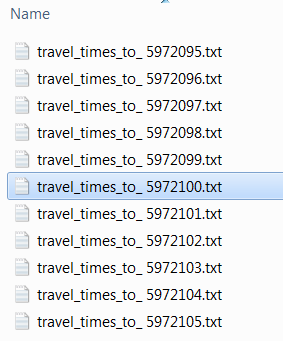

Reading and writing text files
==============================

Reading and writing text files within a Python code can be very handy for example when you want to document a process,
or to automatically print out simple information and results (for example statistics) when running a bigger process.

Preparations
-------------

Download the example dataset ``5972xxx.zip`` for this section from `this link <https://github.com/Automating-GIS-processes/FEC/raw/master/data/5972xxx.zip>`_.
The zip-file contains a folder with a subset of data from the `Travel Time Matrix dataset <http://blogs.helsinki.fi/accessibility/data/metropaccess-travel-time-matrix/>`_.

Unzip the folder to your local working directory. You should see the following files:

Reading text files
--------------------

.. code:: python

    import os

    # Set path to the folder: (replace with your own filepath!):
    folder = r"C:\HY-Data\username\AutoGIS\Data\5972xxx"

    # Set name of the file
    filename = "travel_times_to_ 5972100.txt"

    # Generate full filepath by combining the folder and filename
    fp = os.path.join(folder, filename)

    # Read all contents of the file:
    with open(fp, "r") as infile:
        text = infile.read()
        print(text)

Writing text files
--------------------

.. code:: python

    # name for the output file
    out_filename = 'test.txt'

    # Open the file in write-mode (if the file does not exit it is generated to the working directory!):
    with open(out_file, 'w') as w:

        # Write a line of text into that file
        my_line = "This is my first line of text written in Python!"
        w.write(my_line)

Listing all files in a directory
--------------------------------

Listing and searching for file path names from file system can be done
using a specific module called `glob <https://docs.python.org/3/library/glob.html>`_.

The glob library contains a function, also called glob, that finds files
and directories whose names match a given pattern (for example all files starting with the letter A).

1. We can use the glob-module to get the names of all files in a given directory (``C:/.../data/5972xxx/``):

.. code:: python

    import glob

    #Read file paths for all files in the folder to a list:
    DataPathList = glob.glob('.../data/5972xxx/*'))

    len(DataPathList)   #number of items in the list
    print(DataPathList) # print all file paths

2. We can also search for only specific files and file formats. Here, we
   search for files that starts with ``travel_times_to_ 59721`` and ends with file
   format ``.txt``:

.. code:: python

    DataPathList = glob.glob('/data/travel_times_to_ 59721*.txt'))

    len(DataPathList)   #number of items in the list
    print(DataPathList) # print all file paths

Reading data from multiple files
-------------------------------------

As the previous examples show, glob.glob’s result is a **list** of file
and directory paths in arbitrary order. This means we can loop over it
to do something with each filename in turn. What we want to do next is
to read the first line of each file and add it to a list called
``headers``.

1. Let's create a list of headers for the files:

.. code:: python

     #Set folder:
     folder = r"C:\HY-Data\username\AutoGIS\Data\5972xxx"

     # Get filepaths for all files which end with ".txt" and start with "travel_times_to_ 59721":
     filepaths = glob.glob(os.path.join(folder, 'travel_times_to_ 59721*.txt')

     # Create an empty list for collecting the headers
     headers = []

     # iterate for each file path in the list
    for fp in filepaths:

        #Open the file in read mode
        with open(fp, 'r') as f:
           # Read the first line of the file
           first_line = f.readline()
           # Append the first line into the headers-list
           headers.append(first_line)

    #After going trough all the files, print the list of headers
    print(headers)

    # you should observe that the file headers (first row of data) is identical in each file in the folder.

Working with delimited text files
-----------------------------------

Simple tabular data is often stored in delimited text files, where each row of data represents
a record of data (for example a country) and the attributes for each row are separated
with a specific character (for example a comma ``,``). First row of data often contains the column names for the array.

.. note::

    When working with Comma-Separated Values file (*csv), **pay attention to your language and region-settings!** (In Windows: Control panel > Region and language > Additional Settings)
    There you can determine the decimal separator as ``.`` (recommended) or ``,`` and the list separator as ``;`` or ``,``.

Python has powerful modules for handling tabular data (both spatial and non-spatial), however, during this short course we will only dive deeper in the functionality of the ArcPy-module in the context of geospatial data.
You can find more information about essential modules for handling tabular data in Python from the more extensive versions of this course:

* `Pandas and Geopandas <https://automating-gis-processes.github.io/2016/Lesson2-overview-pandas-geopandas.html>`_
* `NumPy <https://github.com/Python-for-geo-people/Lesson-6-Intro-to-NumPy>`_
