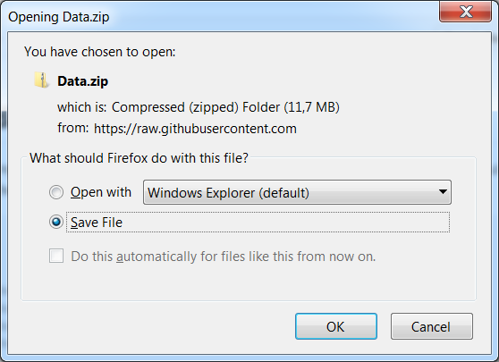
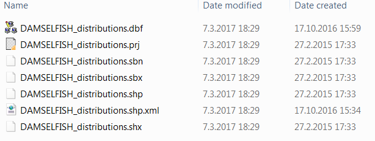
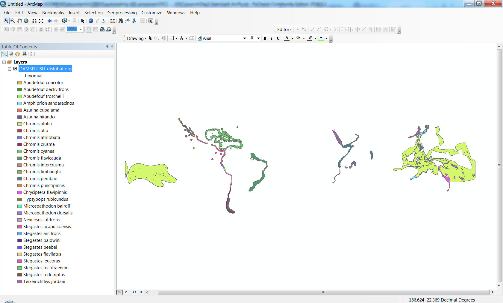

Automating ArcGIS-processes
=================

.. figure:: img/arcpy-logo.png

    :width: 200 px

In this section we will take a tour on **how to use Python in ArcGIS** using `arcpy <http://desktop.arcgis.com/en/arcmap/10.3/analyze/arcpy/what-is-arcpy-.htm>`_ -module.
For doing the ArcPy-exercises you need to work on a computer where `ArcGIS <http://desktop.arcgis.com/en/>`_ is installed. ArcGIS is not an open source or freely available
software such as `Quantum GIS <http://www.qgis.org/en/site/>`_ or the other Python tools that we have been using. However, it is widely used software in many places (companies, public sector etc.)
which is the reason why we give this introduction how you can automatize ArcGIS workflows using Python scripting and the ArcPy-module.

Learning objectives
-------------------

The aim is to learn the basics how the ArcGIS tools can be run using ArcPy-functions in Python, and how we can
create a graphical user interface for your custom scripts in the ArcToolbox (.tbx -file).

After completing the ArcPy-lesson and exercises you should be able to:

 - Create a simple user interface using ArcGIS ToolBox.

 - Run ArcGIS-tools from Python using the ArcPy-module.

 - Find and know how to read the ArcPy documentation online.

Case: Processing species distribution data
--------------------------------------------

The source data has been downloaded from the `IUCN Red List of Threatened Species website <http://www.iucnredlist.org/technical-documents/spatial-data>`_.
We will be working with the species distribution data of different subspecies of Damselfish (*Pomacentridae*). In practice, we will incrementally create an ArcGIS Python tool that
**converts the individual Damselfish species distribution Polygons into raster layers** (``.tif``). Such processing step has been included in the methodology for prioritizing global
conservation areas based on the occurrence of endangered species (`Pouzols et al. 2014 <https://helda.helsinki.fi/bitstream/handle/10138/156062/PouzolsToivonenEtal_NonFinalProof_Nature_2014.pdf?sequence=1>`_).

Download source data for the exercise
--------------------------------------

Download the source data for the arcpy-exercise `from this link <https://github.com/Automating-GIS-processes/FEC/raw/master/data/DAMSELFISH.zip>`_

The zip-file contains a shapefile `DAMSELFISH_distributions.shp` and related files.
Extract the zip file (right click and select "Extract All") to your local folder:

    Source data for this exercise: the Damselfish distribution shapefile visualized based on the attribute "binomial".

