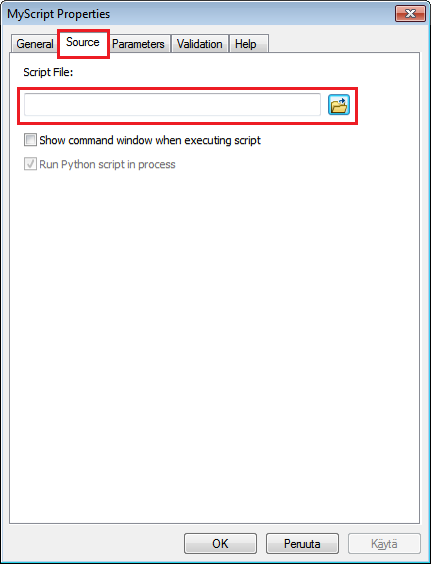
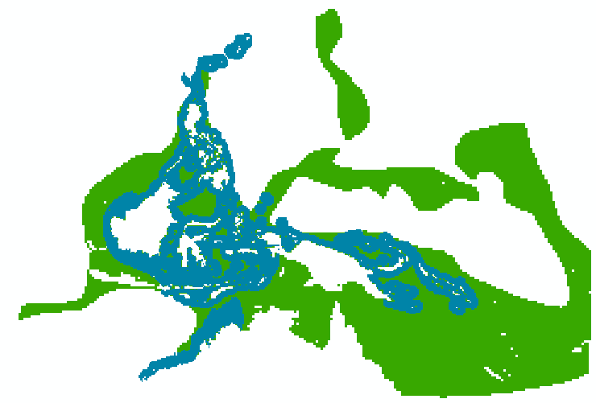

Running the Python script from ArcGIS
=====================================

Now that we have the interface and script ready for our tool, we can start using them from ArcGIS.

Before we can run the tool, we need to specify **which Python script will be run when the tool is executed**. This can be done from the ``Properties`` of your Script tool under a ``Source`` -tab. Add the
``Arcpy_1_SimplePoly2Raster.py`` -file that we just created as the source file for this tool.

.. figure:: img/arcgis-properties.png
    :scale: 95 %
    :align: left

That's it! Now you can test your tool by running it from ArcGIS!

After running your tool, you should get a raster that looks something like this:

However, this output is not yet as desired, because information about overlapping species ranges has been lost.
In the more advanced version of our tool, we will learn how to split the shapefile into multiple files based on
the species attribute ``binomial`` (one file for each subspecies).

