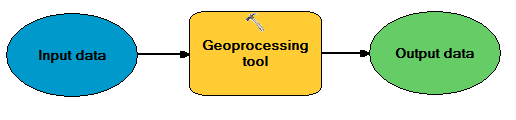
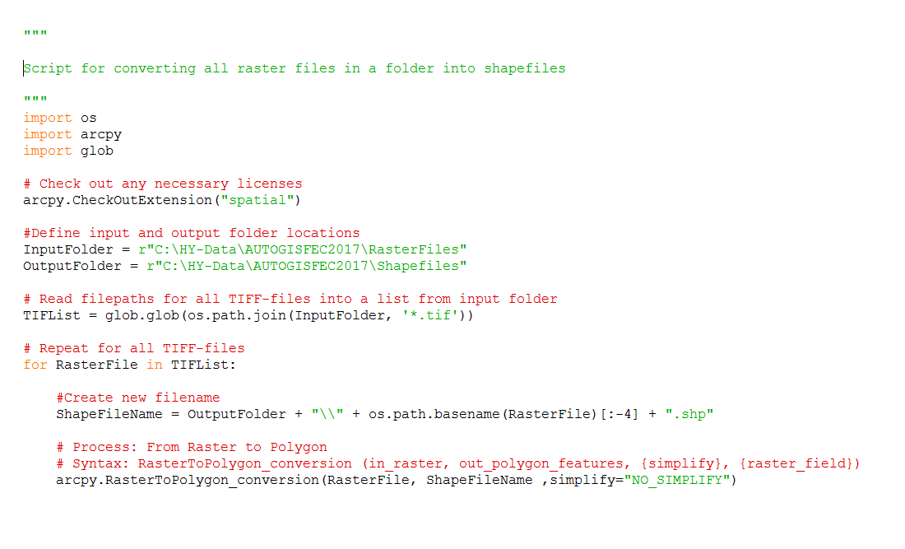

.. FEC-2017 documentation master file, created by
   sphinx-quickstart on Mon Feb 20 15:58:24 2017.
   You can adapt this file completely to your liking, but it should at least
   contain the root `toctree` directive.

Welcome to Automating GIS processes/ FEC 2017!
================================================
**6.-10.3.2017 at the Kumpula Campus**, University of Helsinki. Rooms A113-A114.

This course will introduce you the basics of programming and automatization of GIS-processes in the Python programming language.

Materials have been tailored for the further education course *Paikkatiedon käyttö ja hyödyntäminen* F.E.C. organized by `HY+ <http://hyplus.helsinki.fi/>`_.

The course consists of interactive lectures and exercises. All course material will be distributed via these pages. Materials are based on previous further education courses and two more extensive course packages: `Python for geo-people <https://github.com/Python-for-geo-people/Course-information>`_ and `Automating GIS-processes <https://automating-gis-processes.github.io/2016/>`_ developed at the `Department of Geosciences and Geography <http://www.helsinki.fi/geo/english/index.html>`_, University of Helsinki.

At the end of the course you should be able to generate, understand and use code for automating GIS-processes such as the one below.

Course contents:
----------------

.. toctree::
    :maxdepth: 2
    :caption: Course information

.. toctree::
    :maxdepth: 2
    :caption: Day 1

    Day1-Intro
    Day1-Getting-started-with-python
    Day1-working-environment
    Day1-Data-types
    Day1-string-operations
    Day1-Strings-mini-exercise
    Day1-writing-scripts
    Day1-intro-to-GitHub
    Day1-create-GitHub-account
    Day1-Exercise1

.. toctree::
    :maxdepth: 2
    :caption: Day 2

    Day2-conditional-statements
    Day2-for-loops
    Day2-for-loops-mini-exercise
    Day2-Exercise2
    Day2-functions
    Day2-modules
    Day2-Exercise3-Functions
    Day2-reading-files
    Day-3-useful-functions
    Day2-mini-exercise-writingFiles

.. toctree::
    :maxdepth: 2
    :caption: Day 3

    Day3-arcpy-overview
    Day3-arcpy
    Day3-Exercise4-ArcPy
    Day3-toolbox
    Day3-arcpy-script
    Day3-run-the-tool

.. toctree::
    :maxdepth: 2
    :caption: Day 4

.. toctree::
    :maxdepth: 2
    :caption: Day 5

